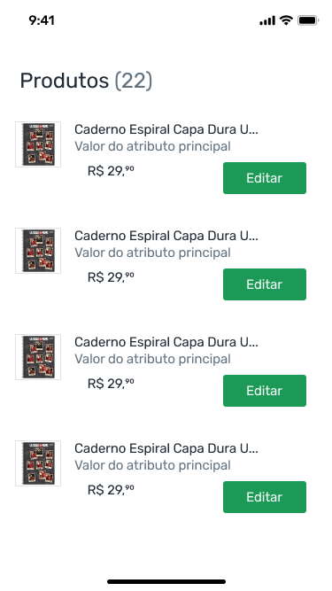
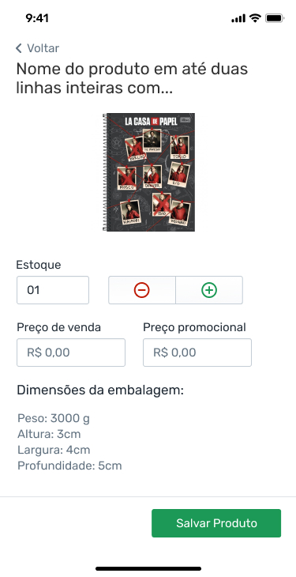

## O Desafio

O desafio consistem em criar uma aplicação mobile (React Native) que permita a navegação entre 2 telas, são elas:

- Home do app em que são listados todos os produtos;
- Página de detalhes de um produto, onde seja possível editar os campos daquele determiado produto;

Na home, ao clicar em um produto, o usuário deve ser redirecionado para a página de detalhe desse produto.

Na tela de detalhe do produto, o usuário deve poder editar o estoque e os preços do produto. Essa mudança deve refletir na listagem, caso seja necessário.

Essa é a base do desafio, você pode nos surpreender com quaisquer detalhes que quiser :D

## Assets

Utilizar a fonte fornecida na pasta `assets`.

## API

Você irá consumir uma API GraphQL que irá fornecer os dados do arquivo `db/index.js`. Para levantar essa API, basta instalar as dependências deste repositório e rodar o comando:

`$ yarn database`

A API roda por padrão em http://localhost:3000/, caso você queira rodar em outra porta basta passar o parâmetro no comando acima: `--p <nova porta>`

## O que nós esperamos do seu desafio

- Usar React e React Native;
- Usar [React Hooks](https://pt-br.reactjs.org/docs/hooks-intro.html);
- Utilizar [Apollo Client](https://www.apollographql.com/docs/react/) para realizar as consultas a API;
- Estilização com [Styled components](https://styled-components.com/);
- Não utilizar bibliotecas de componentes/design system como Bootstrap, Material UI, etc;
- Aplicação dividida em componentes claros, de responsabilidade única e facilmente reutilizáveis;
- Tratamento adequado de possíveis erros;
- Usar [Git Flow](https://www.atlassian.com/git/tutorials/comparing-workflows/gitflow-workflow);
- Usar Typescript;
- Utilizar listas virtualizadas (ex. [FlatList](https://reactnative.dev/docs/flatlist))

## O que nos impressionaria (famoso bônus)

- Testes automatizados (ex: [Jest](https://jestjs.io/docs/en/tutorial-react-native));
- [Manipulação de cache](https://www.apollographql.com/docs/react/caching/cache-interaction/) das requisições com Apollo Client

## O que avaliaremos do seu desafio

- Histórico de commits do git;
- As instruções de como rodar o projeto;
- Organização, semântica, estrutura, legibilidade, manutenibilidade do seu código;
- Alcance dos objetivos propostos;
- Componentização e extensibilidade dos componentes Javascript;

## Dicas

### DO

- Componentes pequenos e claros;
- Features do ES6 que simplificam o código, como object destructuring, rest operator, etc;
- Se você tiver disponibilidade, teste sua aplicação em Android e iOS, mas pode ficar tranquilo, isso não é requisito, garanta que esteja tudo ok na plataform que você conseguir desenvolver.

### DON'T

- Código duplicado;
- Funções/Classes longos demais;
- Muitos if/else;
- Uso de estruturas de dados inadequados;
- Funções/métodos com muitos parâmetros;
- Console.log no envio final;
- Retornar estado de erro em vez de levantar exceção;
